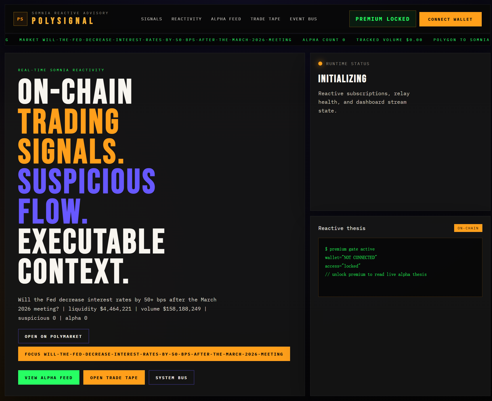
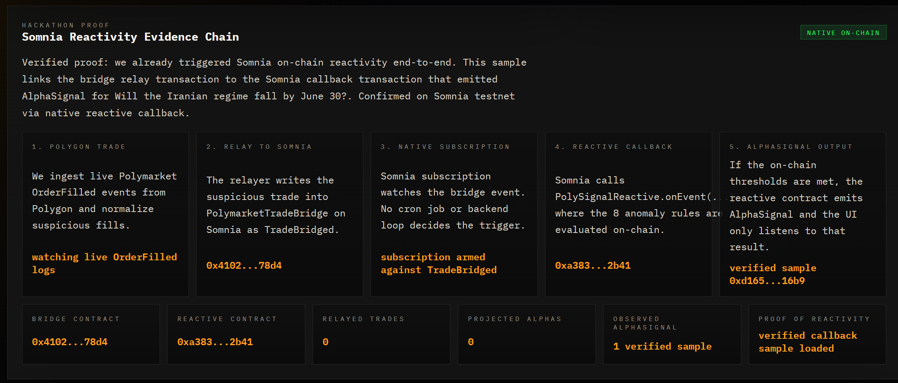
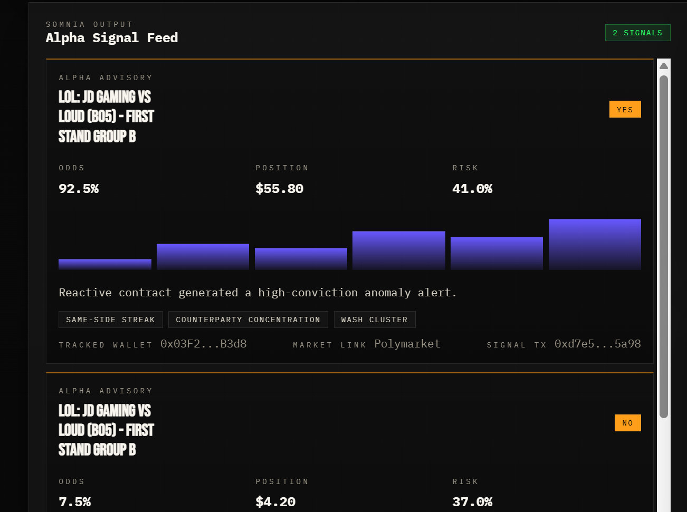
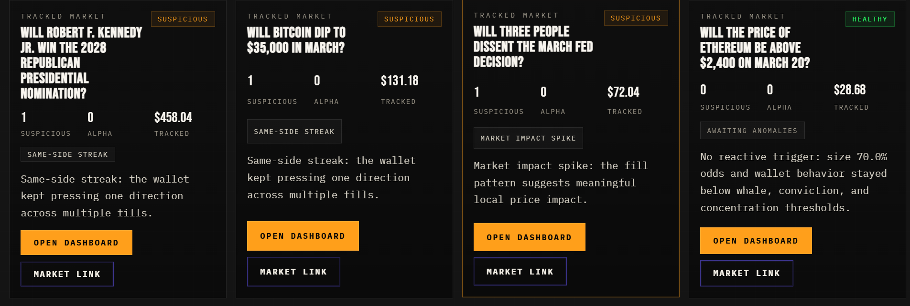

# polyVis

这个仓库现在已经按 Reactive Network 黑客松提交结构整理为：
`PolySignal - Reactive Polymarket Whale Alert`

英文版说明是主文档：
[README.md](./README.md)

## 先说结论

在这次改造之前，你的项目**还不够稳妥地满足**比赛要求。

## 产品亮点展示

下面是演示了核心功能及 Somnia 原生响应式的关键截图：

**1. 预测市场主看板与全景追踪**  
  
*实时展示追踪市场的全景指标（流动性、成交量、资金倾向），并通过 Web3 钱包网关实现原生门槛鉴权（Premium 访问）。*

**2. Somnia 链上响应式证据链 (Evidence Chain)**  
  
*展示端到端的 Reactivity 证明。从 Polygon 提取的交易被投入我们的中继桥，从而在 Somnia 内原生地触发安全且纯链上的订阅及 Alpha 评估。*

**3. 链上 Alpha 信号高级推送源**  
  
*当 8 种大户和异常行为规则在链上的 `PolySignalReactive` 评估被满足后，会直接释放携带确切买卖方向、赔率与头寸风险的 Alpha 信号。*

**4. 活跃市场的异常监控**  
  
*能够实时观测单一市场的“同一方向连击”、“极端资金面”和“大户入场”等多维指标，让预测市场里的散户不再盲目。*

主要原因：

- 原来的 `PolySignalReactive.sol` 是 Somnia 风格的回调处理，不是标准 Reactive Network `Reactive Contract`
- 缺少标准的 `Destination callback contract`
- 缺少清晰的 `Origin + Reactive + Destination` 三段式仓库结构
- 缺少按比赛要求组织好的部署工作流、地址表、交易哈希记录模板

现在仓库里已经补齐了 Reactive Network 版本的关键部分。

## 现在的标准提交结构

- `contracts/reactive/PolySignalOrigin.sol`
  - Sepolia 上的 Origin 合约
  - 接收中继后的 Polymarket 异常交易摘要，并发出 `TradeSignalObserved`
- `contracts/reactive/PolySignalReactiveNetwork.sol`
  - Reactive Network 上的标准 Reactive Contract
  - 基于 `AbstractReactive`
  - 监听 Origin 事件并自动触发 callback
- `contracts/reactive/PolySignalDestination.sol`
  - Sepolia 上的 Destination callback 合约
  - 基于 `AbstractCallback`
  - 接收回调并把最终 alpha signal 落到链上
- `scripts/deploy-reactive-foundry.sh`
  - 一键部署 Origin / Destination / Reactive
- `scripts/relayPolymarketToOrigin.js`
  - 拉取 Polymarket 数据并把异常交易提交到 Origin
- `test/PolySignalReactiveNetwork.js`
  - 本地端到端测试，模拟 `Origin -> Reactive -> Destination`

## 新的链路

现在主提交流程是：

`Polygon Polymarket trade -> Sepolia Origin -> Reactive Lasna RC -> Sepolia Destination`

运行逻辑：

1. 真实的 Polymarket 交易先发生在 Polygon。
2. 脚本抓取这笔交易，并计算异常画像。
3. 脚本调用 Sepolia 上的 `PolySignalOrigin.reportTradeSignal(...)`。
4. Origin 发出 `TradeSignalObserved`。
5. Reactive Network 上的 `PolySignalReactiveNetwork` 监听到这个事件。
6. RC 在链上执行规则判断。
7. 如果达到阈值，RC 发出 `Callback(...)`。
8. Sepolia 上的 `PolySignalDestination.recordSignal(...)` 被自动调用。
9. 最终 alpha signal 在 Destination 合约中持久化。

## 为什么这比普通 Solidity 更符合比赛要求

因为这里的关键自动化不是后端手动写死的，而是：

- Reactive Contract 真正监听链上事件
- 事件出现后自动触发下一笔目标交易
- 目标交易的落点是独立的 Destination 合约

如果没有 Reactive 层：

- 你只能依赖中心化 bot / cron / 后端服务
- 自动触发链上动作这件事无法通过合约结构清晰表达
- 评委很容易判定“只是普通 Solidity 合约部署到某条链上”

## 你现在怎么跑

```bash
npm install
cp .env.example .env
forge build
npm test
npm run deploy:reactive
npm run relay:reactive
```

说明：

- `forge build`：编译所有合约
- `npm test`：跑本地端到端测试
- `npm run deploy:reactive`：部署到 `Sepolia + Reactive Lasna`
- `npm run relay:reactive`：把真实 Polymarket 异常交易提交到 Origin

## 本地已经验证的内容

当前我已经帮你验证到：

- `forge build` 通过
- `npm test` 通过
- 本地完整模拟了：
  - Origin 事件产生
  - Reactive Contract 收到日志并执行
  - RC 发出 callback
  - Destination 成功记录 signal

## 还需要你在真实网络上补的部分

这些必须在你自己的钱包和 RPC 环境里实跑后才能真实填写：

- Sepolia 部署地址
- Reactive Lasna 部署地址
- Origin 交易哈希
- Reactive 交易哈希
- Destination 交易哈希

我已经把提交模板放在：

- `docs/HACKATHON_SUBMISSION.md`

你部署并跑完真链流程后，把地址和 tx hash 填进去即可。
